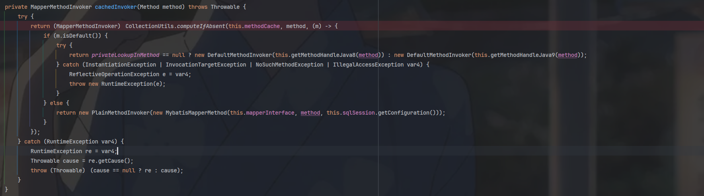

首先会判断这个方法是不是默认方法，比如toString(),notifyAll()



不是的话会创建这个方法：


最后才执行这个方法：


调用执行execute方法


判断执行方法类型


疑问：

1. **resultMap的基本概念**
- 在MyBatis中，`resultMap`是用于将从数据库查询到的结果（通常是表中的列）映射到Java对象的一种配置机制。它定义了数据库列名和Java对象属性之间的对应关系。
- 当MyBatis执行查询语句时，查询结果是按照数据库中的列来返回的，而这些列需要正确地转换为Java对象中的属性，`resultMap`就是实现这个转换的桥梁。

2. **使用resultMap的原因**
    - **解决列名和属性名不一致的问题**：
        - 数据库中的列名和Java对象的属性名可能存在差异。例如，数据库表中有一个列名为`user_name`，而对应的Java对象属性可能是`userName`。通过`resultMap`可以明确这种映射关系，如下所示：
      ```xml
      <resultMap id="userResultMap" type="com.example.User">
          <result property="userName" column="user_name" />
      </resultMap>
      ```
        - 这样，MyBatis就能正确地将`user_name`列的值赋给`User`对象的`userName`属性。
    - **处理复杂的对象关系（关联查询）**：
        - 在进行关联查询时，一个查询可能会返回多个表的数据。例如，查询用户信息和用户所属部门信息，`resultMap`可以用于将这些来自不同表的数据正确地组合到一个Java对象或者对象之间的关联关系中。
        - 假设用户表（`users`）和部门表（`departments`）通过`department_id`关联，查询语句返回用户信息和部门名称，`resultMap`可以这样定义：
      ```xml
      <resultMap id="userWithDepartmentResultMap" type="com.example.UserWithDepartment">
          <result property="userId" column="user_id" />
          <result property="userName" column="user_name" />
          <association property="department" javaType="com.example.Department">
              <result property="departmentName" column="department_name" />
          </association>
      </resultMap>
      ```
        - 这里通过`association`元素定义了`UserWithDepartment`对象中的`Department`对象（通过`property="department"`指定）与查询结果中的部门信息（通过`result`元素中的`column="department_name"`等映射）的关联关系，从而正确地构建复杂的对象关系。
    - **自定义数据转换和映射规则**：
        - 有时候，需要对从数据库查询到的数据进行一些额外的处理或转换，再赋值给Java对象的属性。例如，数据库中存储的日期格式可能是`yyyy - MM - dd HH:mm:ss`，但Java对象中的日期属性希望是`java.util.Date`类型的特定格式。
        - 可以在`resultMap`中使用`typeHandler`来实现自定义的转换，如下所示：
      ```xml
      <resultMap id="customDateResultMap" type="com.example.CustomDateObject">
          <result property="customDate" column="date_column" typeHandler="com.example.CustomDateTypeHandler" />
      </resultMap>
      ```
        - 其中`CustomDateTypeHandler`是自定义的类型处理器，用于将数据库中的日期格式转换为Java对象中需要的日期格式。

3. **不使用resultMap的情况（简单查询）**
    - 在某些简单的查询中，如果数据库列名和Java对象属性名完全一致，并且不需要进行复杂的对象关系处理或数据转换，MyBatis可以自动进行映射。
    - 例如，查询一个只有几列且列名和Java对象属性名相同的表，如下所示的查询语句可以不使用`resultMap`：
   ```xml
   <select id="selectSimpleUsers" resultType="com.example.User">
       SELECT user_id, user_name FROM users
   </select>
   ```
    - 这里的`resultType`指定了返回的结果类型为`User`，如果列名和`User`对象的属性名匹配，MyBatis会自动进行简单的映射。不过，一旦查询变得复杂或者需要更精细的映射控制，`resultMap`就会变得非常有用。````